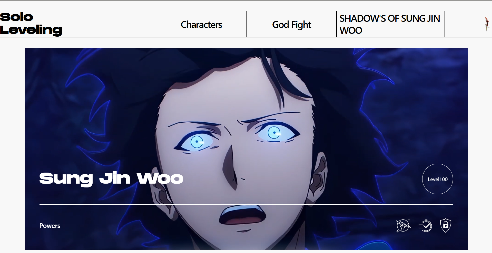

# Solo Leveling — Landing Page

A clean, responsive static landing page inspired by the "Solo Leveling" aesthetic. This repo contains a single-page HTML site with lightweight utility classes (Tailwind-style) and simple asset organization.

---

## Preview

---

## Live site

[Visit live site ↗](https://your-live-site-url.example)

---

## What's included

- `index.html` — The landing page markup and inline styles.
- `Assets/` — All images, icons and the video referenced by the page. Add `preview.png` here for the README.
- `font/` — Local fonts used by the page.

---

## Features

### Built with Tailwind CSS Utility Classes

This landing page leverages Tailwind's utility-first approach to deliver a fast, efficient, and maintainable design:

- **⚡ Blazing Fast Development** — Rapidly prototype and build responsive layouts using utility classes directly in HTML without switching between files.

- **📦 Minimal CSS Overhead** — Tailwind's utility classes eliminate redundant CSS. Only the styles you use are applied, keeping the stylesheet lean and load times fast.

- **🎨 Consistent Design System** — Predefined spacing, colors, and typography scales ensure visual consistency across the entire page without custom CSS.

- **📱 Responsive by Default** — Tailwind's responsive modifiers (`sm:`, `md:`, `lg:`) make it effortless to create mobile-first, adaptive layouts that work seamlessly across all devices.

- **🔧 Highly Customizable** — Easily extend or override Tailwind's defaults via configuration to match your brand or design requirements.

- **♻️ Reusable Components** — Utility classes encourage component-based thinking, making it simple to extract and reuse design patterns throughout the project.

- **🚀 Production-Ready Performance** — With PurgeCSS integration, unused styles are automatically removed in production builds, resulting in incredibly small CSS bundles and faster page loads.

---

## Credits

Made with ❤️ by Taksh Patel. Assets and images used in this project are either included in `Assets/` or hotlinked; ensure you have the rights to redistribute any images you add.

## License

MIT © Taksh Patel
